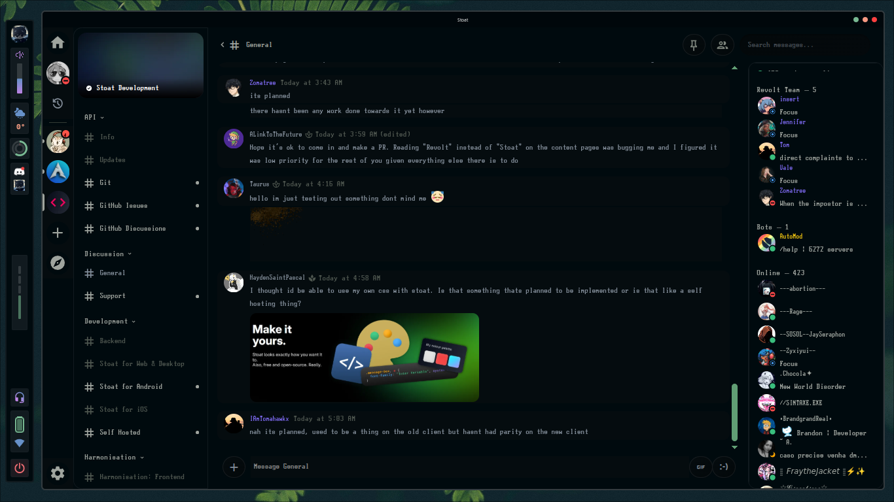

<div align="center">
<h1>
  Stoat for Desktop
  
  [](https://github.com/stoatchat/for-desktop/stargazers)
  [](https://github.com/stoatchat/for-desktop/network/members)
  [](https://github.com/stoatchat/for-desktop/pulls)
  [](https://github.com/stoatchat/for-desktop/issues)
  [](https://github.com/stoatchat/for-desktop/graphs/contributors)
  [](https://github.com/stoatchat/for-desktop/blob/main/LICENSE)
</h1>
Application for Windows, macOS, and Linux.

</div>
<br/>

## Development Guide

_Contribution guidelines for Desktop app TBA!_

<!-- Before contributing, make yourself familiar with [our contribution guidelines](https://developers.revolt.chat/contrib.html), the [code style guidelines](./GUIDELINES.md), and the [technical documentation for this project](https://revoltchat.github.io/frontend/). -->

Before getting started, you'll want to install:

- Git
- Node.js
- pnpm (run `corepack enable`)

Then proceed to setup:

```bash
# clone the repository
git clone --recursive https://github.com/stoatchat/for-desktop stoat-for-desktop
cd stoat-for-desktop

# install all packages
pnpm i --frozen-lockfile

# start the application
pnpm start
# ... or build the bundle
pnpm package
# ... or build all distributables
pnpm make
```

Various useful commands for development testing:

```bash
# connect to the development server
pnpm start -- --force-server http://localhost:5173

# test the flatpak (after `make`)
pnpm install:flatpak
pnpm run:flatpak
# ... also connect to dev server like so:
pnpm run:flatpak --force-server http://localhost:5173

# Nix-specific instructions for testing
pnpm package
pnpm run:nix
# ... as before:
pnpm run:nix --force-server=http://localhost:5173
# a better solution would be telling
# Electron Forge where system Electron is
```

### Pulling in Stoat's assets

If you want to pull in Stoat brand assets after pulling, run the following:

```bash
# update the assets
git -c submodule."assets".update=checkout submodule update --init assets
```

Currently, this is required to build, any forks are expected to provide their own assets.
